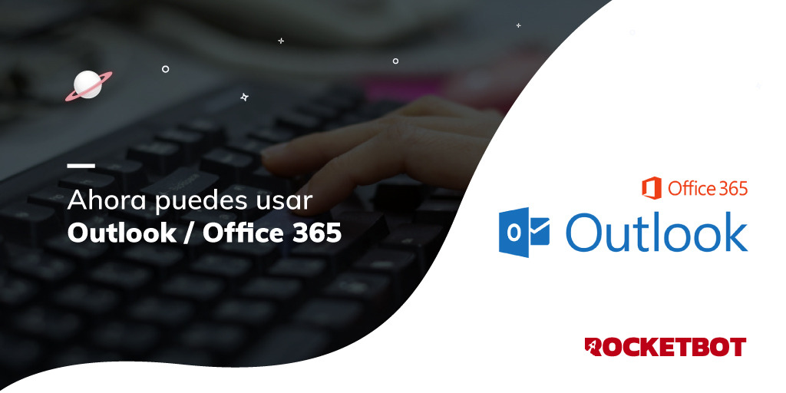

# O365
  
Conecte-se ao Outlook usando o O365.  

*Read this in other languages: [English](Manual_O365.md), [Portugues](Manual_O365_pr.md), [Español](Manual_O365_es.md).*

## Como instalar este módulo
  
__Baixe__ e __instale__ o conteúdo na pasta 'modules' no caminho do Rocketbot.

## Como usar este módulo

Antes de usar este módulo, você precisa registrar seu aplicativo no portal de Registros de Aplicativo do Azure.

1. Entre no portal do Azure e procure o serviço Azure Active Directory.
2. Lá, no menu do lado esquerdo, digite "Registro do Aplicativo".
3. Selecione "Novo registro".
4. Em "Tipos de conta compatíveis" suportados, escolha:
    a. "Contas em qualquer diretório organizacional (qualquer diretório do Azure AD: multilocatário) e contas pessoais da Microsoft (como Skype ou Xbox)" para este caso, use ID de locatário = common
    b. "Somente contas deste diretório organizacional (somente esta conta: locatário único) para este caso usam ID de locatário específico do aplicativo.
5. Defina o uri de redirecionamento (Web) como: https://login.microsoftonline.com/common/oauth2/nativeclient e clique em "Registrar".
6. Copie o ID do aplicativo (cliente). Você vai precisar desse valor.
7. Em "Certificados e segredos", gere um novo segredo do cliente. Defina a validade (de preferência 24 meses). Copie o VALUE do segredo do cliente criado (NÃO o ID do segredo). Ele vai esconder depois de alguns minutos.
8. Em "Permissões de API", clique em "Adicionar uma permissão", selecione "Microsoft Graph", depois em "Permissões delegadas", localize e selecione "Mail.ReadWrite" e "User.Read" e, finalmente, "Adicionar permissões".
9. No Rocketbot Studio, insira o comando "Connect to O365", insira os dados solicitados (ID do cliente, valor secreto e locatário) e execute o comando.
10. No console do Rocketbot será gerado um URL (Exemplo: https://login.microsoftonline.com/common/oauth2/v2.0/authorize?response_type=code&client_id=82f8efcd-6a0d-4532-a62e-3e2aecb4d19f&redirect_uri=https%3A%2F%2Flogin.microsoftonline.com%2Fcommon%2Foauth2%2Fnativeclient&scope=Mail.ReadWrite+User.Read.All&state=3LvNFBfX0qej9Q0rsixmSWjCGJyi0M&access_type=offline), copie e cole no seu navegador.
11. Aceite a concessão de permissões e retornará uma tela sem conteúdo. Copie o URL (Exemplo: https://login.microsoftonline.com/common/oauth2/nativeclient?code=M.R3_SN1.5dcda10b-6567-ce05-3a5b-f67145c62684&state=3LvNFBfX0qej9Q0rsixmSWjCGJyi0M) e cole-o no console do Rocketbot abaixo de "Paste the authenticated url here:".
12. Pressione "enter" e se a operação foi bem sucedida você verá no console: "Authentication Flow Completed. Oauth Access Token Stored. You can now use the API." e será criado um arquivo com suas credenciais, na pasta raiz do Rocketbot, chamado o365_token.txt o o365_token_{session}.txt.

## Descrição do comando

### Conectar a O365
  
Conectar-se à instância do aplicativo O365
|Parâmetros|Descrição|exemplo|
| --- | --- | --- |
|client_id||client_id|
|client_secret||client_secret|
|tenant_id||tenant_id|
|session||session|
|Conectar ao Sharepoint||-|

### Listar todos os e-mails
  
Listar todos os e-mails, você pode especificar um filtro
|Parâmetros|Descrição|exemplo|
| --- | --- | --- |
|Filter||subject eq 'compras'|
|ID Pasta||Inbox|
|Número de e-mails para listar||25|
|Atribuir à variável||Variable|
|session||session|

### Listar e-mails não lidos
  
Liste todos os e-mails não lidos da sua caixa de correio
|Parâmetros|Descrição|exemplo|
| --- | --- | --- |
|ID Pasta||Inbox|
|Número de e-mails para listar||25|
|Atribuir à variável||Variable|
|session||session|

### Ler e-mail para identificação
  
Ler um e-mail usando seu ID
|Parâmetros|Descrição|exemplo|
| --- | --- | --- |
|Identificação do email||345|
|Caminho para download do anexo||C:\User\Desktop|
|Baixar anexos||-|
|Marcar como lido||-|
|Corpo do e-mail HTML|Se esta caixa estiver marcada, retornará o corpo do e-mail na versão HTML.||
|Atribuir à variável||Variable|
|session||session|

### Enviar Email
  
Envia un email
|Parâmetros|Descrição|exemplo|
| --- | --- | --- |
|Para||to@mail.com, to2@mail.com|
|Cc||to1@mail.com, to3@mail.com|
|Assunto||Nuevo mail|
|Mensagem||Esto es una prueba|
|Attached File||C:\User\Desktop\test.txt|
|Pasta (vários arquivos)||C:\User\Desktop\Files|
|session||session|

### Responder Email
  
Responder um email usando seu ID
|Parâmetros|Descrição|exemplo|
| --- | --- | --- |
|Identificação do email||345|
|Cc||to1@mail.com, to3@mail.com|
|Mensagem||Esto es una prueba|
|Attached File||C:\User\Desktop\test.txt|
|Pasta (vários arquivos)||C:\User\Desktop\Files|
|Marcar como lido||-|
|session||session|

### Reenviar um e-mail
  
Reenviar um e-mail usando seu ID
|Parâmetros|Descrição|exemplo|
| --- | --- | --- |
|Identificação do email||345|
|Para||to@mail.com, to2@mail.com|
|Cc||to1@mail.com, to3@mail.com|
|Mensagem||This is a test.|
|Attached File||C:\User\Desktop\test.txt|
|Pasta (vários arquivos)||C:\User\Desktop\Files|
|Marcar como lido||-|
|session||session|

### Baixar anexos
  
Baixar anexos de e-mail
|Parâmetros|Descrição|exemplo|
| --- | --- | --- |
|Identificação do email||345|
|Caminho para download do anexo||C:\User\Desktop|
|Marcar como lido||-|
|Atribuir à variável||Variable|
|session||session|

### Marcarcomo não lido
  
Marcar um e-mail como não lido
|Parâmetros|Descrição|exemplo|
| --- | --- | --- |
|Identificação do email||345|
|Atribuir à variável||Variable|
|session||session|

### Lista de pastas de e-mail
  
Lista de pastas de e-mail
|Parâmetros|Descrição|exemplo|
| --- | --- | --- |
|Atribuir à variável||Variable|
|session||session|

### Mover e-mail
  
Mover um email de uma pasta para outra
|Parâmetros|Descrição|exemplo|
| --- | --- | --- |
|Identificação do email||345|
|Identificação da pasta||345|
|Atribuir à variável||Variable|
|session||session|

### Criar pasta
  
Cria uma nova pasta no e-mail
|Parâmetros|Descrição|exemplo|
| --- | --- | --- |
|ID pasta Pai||Inbox or 345...|
|Nome da nova pasta||new_folder|
|Atribuir à variável||Variable|
|session||session|

### Obter Grupos
  
Obter lista de Grupos aos quais a conta pertence
|Parâmetros|Descrição|exemplo|
| --- | --- | --- |
|Atribuir à variável||Variable|
|session||session|

### Obter Grupos
  
Obter Grupo por ID
|Parâmetros|Descrição|exemplo|
| --- | --- | --- |
|ID do grupo||ID|
|Atribuir à variável||Variable|
|session||session|

### Obter site
  
Obter o site do Grupo
|Parâmetros|Descrição|exemplo|
| --- | --- | --- |
|ID do grupo||ID|
|Atribuir à variável||Variable|
|session||session|

### Obter listas
  
Obter as listas do Site
|Parâmetros|Descrição|exemplo|
| --- | --- | --- |
|ID do grupo||ID|
|Atribuir à variável||Variable|
|session||session|

### Criar List
  
Criar uma nova lista
|Parâmetros|Descrição|exemplo|
| --- | --- | --- |
|ID do Sítio||ID|
|Dados da lista||{'displayName': 'example_name'}|
|Atribuir à variável||Variable|
|session||session|

### Obter itens da lista
  
Obter os itens de uma Lista usando seu nome
|Parâmetros|Descrição|exemplo|
| --- | --- | --- |
|ID do Sítio||ID|
|Nome da lista||name|
|Atribuir à variável||Variable|
|session||session|

### Obter Item
  
Obtenha um Item, usando seu ID, de uma lista
|Parâmetros|Descrição|exemplo|
| --- | --- | --- |
|ID do Sítio||ID|
|Nome da lista||name|
|ID do Item||ID|
|Atribuir à variável||Variable|
|session||session|

### Criar Item
  
Criar um Item dentro de uma Lista
|Parâmetros|Descrição|exemplo|
| --- | --- | --- |
|ID do Sítio||ID|
|Nome da lista||name|
|Dados do Item||{'title': 'data'}|
|Atribuir à variável||Variable|
|session||session|

### Criar Item
  
Eliminar um Item, usando seu ID, de uma Lista
|Parâmetros|Descrição|exemplo|
| --- | --- | --- |
|ID do Sítio||ID|
|Nome da lista||name|
|ID do Item||ID|
|Atribuir à variável||Variable|
|session||session|

### Actualizar Item
  
Actualizar dados do Item usando seu ID
|Parâmetros|Descrição|exemplo|
| --- | --- | --- |
|ID do Sítio||ID|
|Nome da lista||name|
|ID do Item||ID|
|Dados do Item||{'title': 'data'}|
|Atribuir à variável||Variable|
|session||session|
